```mermaid
flowchart TD

  A(["Inicio"])
  A --> B{"Faça uma escolha"}
  B --> C["OP1"]
  B --> D["OP2"]
  B --> E["OP3"]
  

```

```mermaid
graph TD;
  A[Inicio] --> B{Nota >6};
  B --> |SIM| C[Aprovado];
  B --> |NÃO| D[Reprovado];
```

```mermaid
gantt
   title Exemplo de Gráfico de Gantt
   dateFormat YYYY-MM-DD
   section 1ºSemestre
   1º Bimestre ☑️Finalizado:done, 2025-02-02, 60d
   2º Bimestre ☑️Finalizado:done, after a1, 60d
   section 2º Semestre
   3º Bimestre 🕑Em Andamento:active, a3, 2025-08-01, 60d
   4º Bimestre ➡️Em Andamento:crit, a4, after a3,60d
```

```mermaid
  graph TD
      subgraph Matriz
A1["C8"]:::branco --> A2["C20"]:::amarelo --> A3["V50"]:::laranja --> A4["v100"]:::vermelho
  end
class Def branco fill:#fff, stroke:#000, stroke-width:1px;
```
